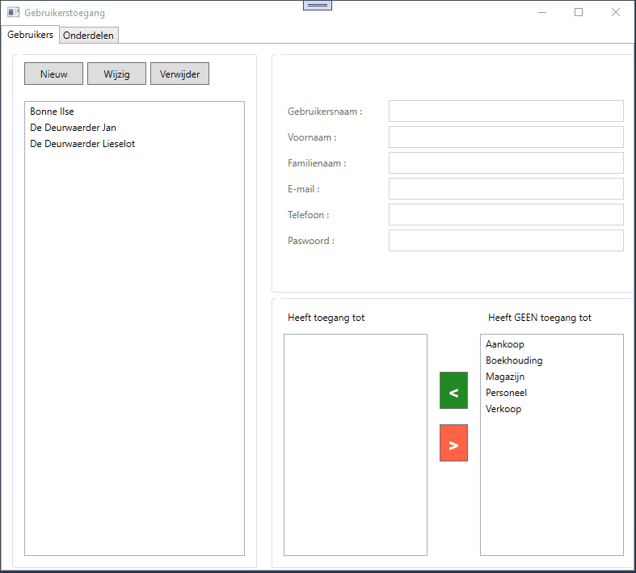

# Oefening Gebruikers met ADO.Net  

  

De bedoeling is om een applicatie te maken rond gebruikersbeheer en aan de gebruikers toegangsrechten te verlenen.  

Voer eerst en vooral het script scalagebruikers.sql uit op je SQL server zodat je over de database met wat testgegevens beschikt.  
Het script zelf kan je terugvinden op het leerplatform.  

Het programma moet gebruikers kunnen afbeelden, toevoegen, wijzigen en/of verwijderen en je moet toegang kunnen verlenen tot bepaalde onderdelen.  

In de starterscode is al heel wat aanwezig : 
  * Voor elke tabel in de database is al een entiteitsklasse gemaakt : je moet uiteraard wel nog invulling geven.  
    Denk er vooral aan dat wanneer je een nieuw object aanmaakt in je app er automatisch een GUID wordt toegekend aan de Id eigenschappen.  
  * 
